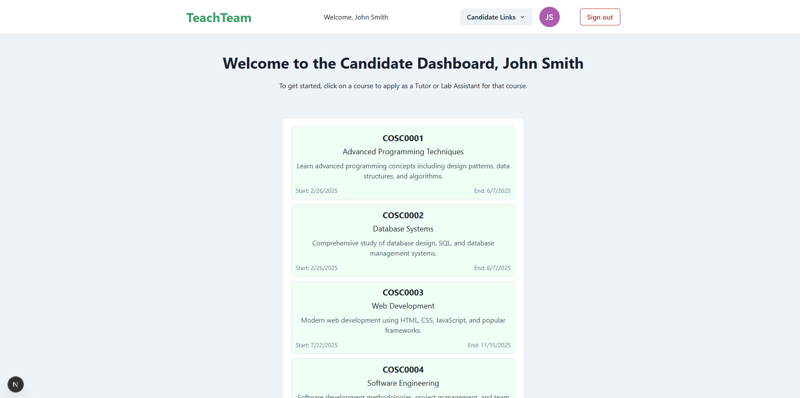
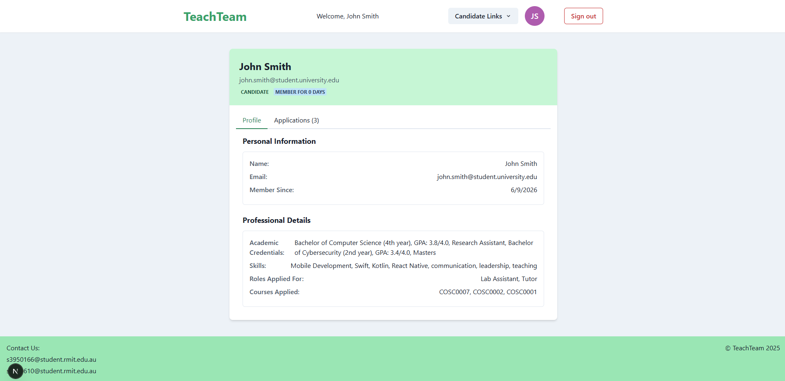
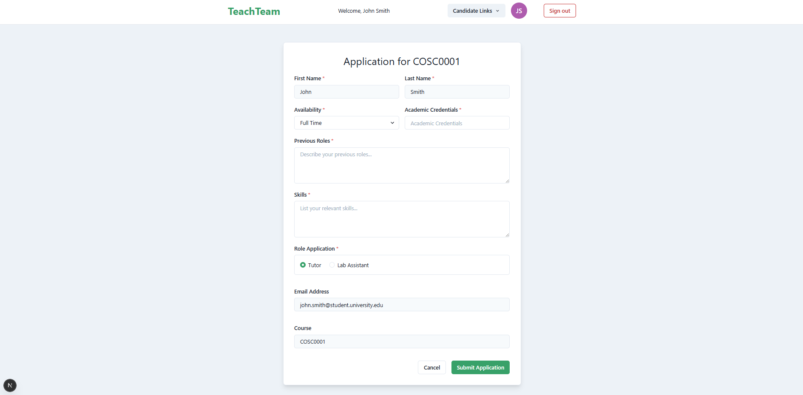
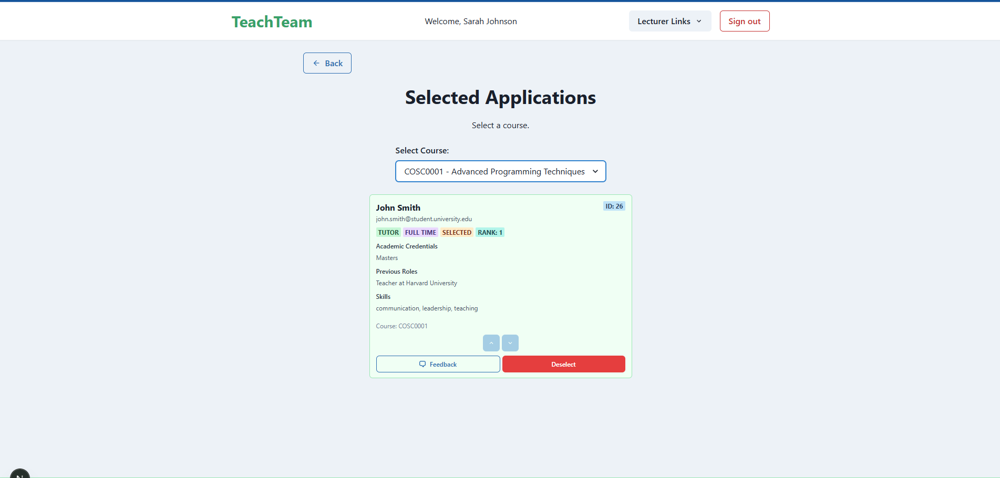
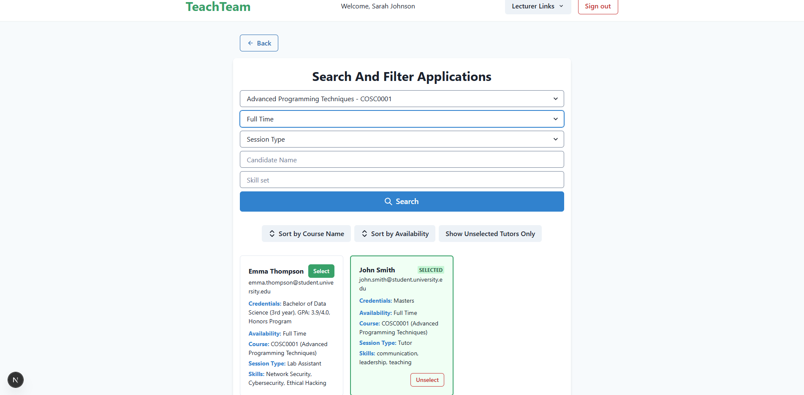
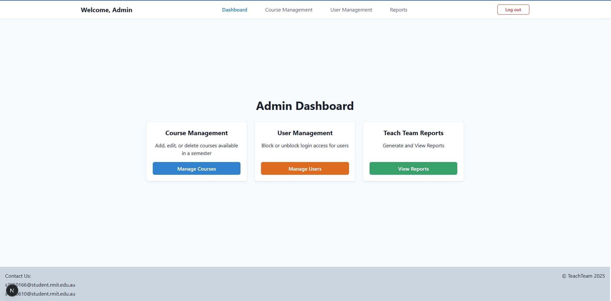
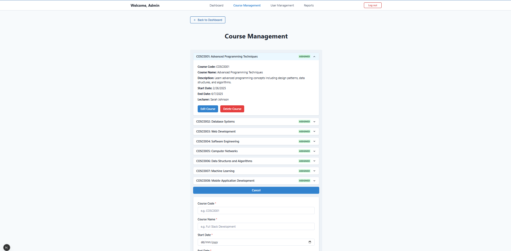
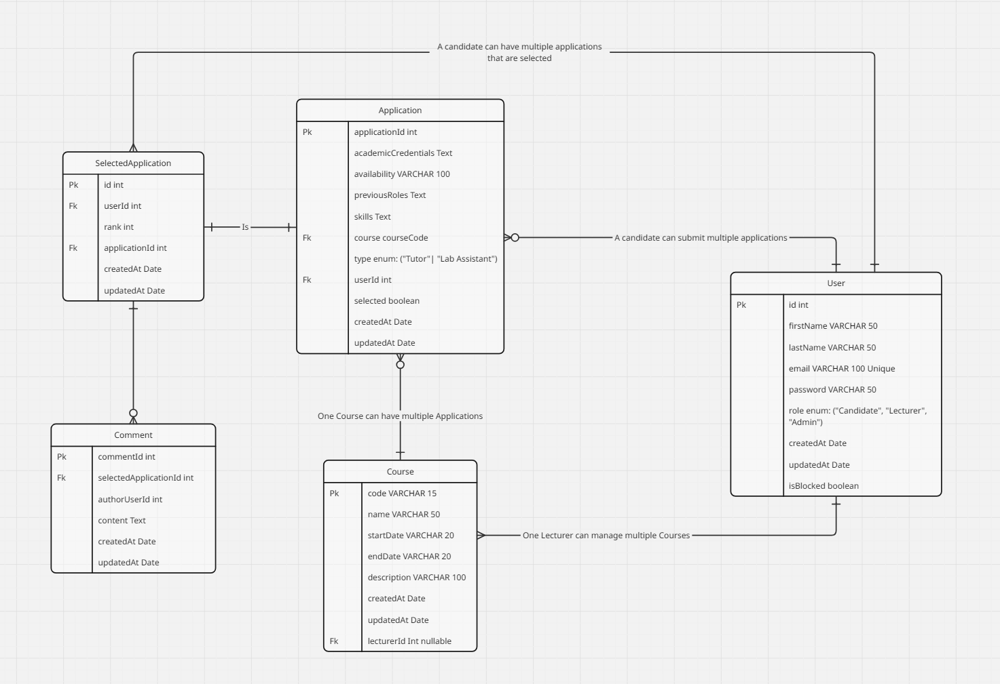

# React-based-App-University-Project
TeachTeam

My teammate and I developed TeachTeam, a web application designed to streamline the process of lecturers hiring tutors or lab assistants for specific university courses with separate dashboards for users and administrators.

## Key Features

- Candidate application system for tutor/lab assistant roles
- Admin dashboard for course and user management and reports
- Candidate filtering and selection workflow
- Lecturer dashboard for selecting candidates
- Role-based access (Admin / Candidate / Lecturer)
- Relational database design supporting course applications

## 🙋‍♂️ My Contributions

### 🔹 Index Page (Landing Page)
Designed the homepage users see before logging in.

### 🔹 Candidate Dashboard
Built the candidate dashboard displaying application status and available courses.

### 🔹 Profile Page
Implemented the candidate profile page showing personal details and application history.

### 🔹 Application Form
Created the application form for candidates applying as lab assistants or tutors.

### 🔹 Selected Candidates View
Developed a view showing selected candidates per course.

### 🔹 Filter & Search System
Implemented search and filter functionality for candidate selection.

### 🔹 Admin Dashboard
Built the admin dashboard for managing applications and system overview.

### 🔹 Course Management (Admin)
Implemented course management functionality for admins to add/edit courses.

### 🔹 ERD (Database Design)
Helped design the relational database structure of this project.

## 🛠 Tech Stack

**Frontend:**
- React
- Chakra UI

**Backend:**
- Node.js
- Express
- GraphQL
- Apollo Server

**Client Communication:**
- Apollo Client

**Database:**
- MySQL

